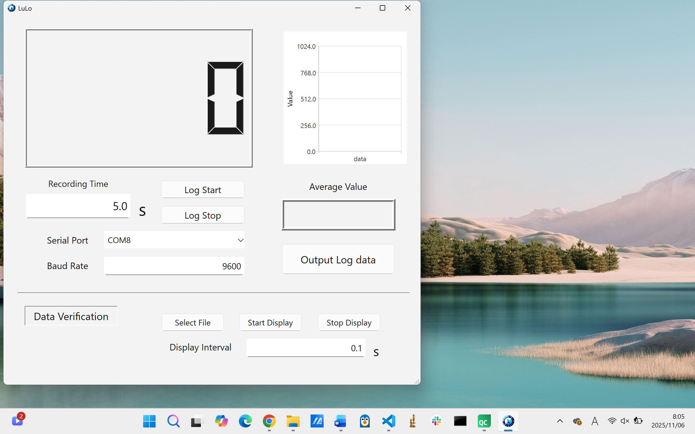
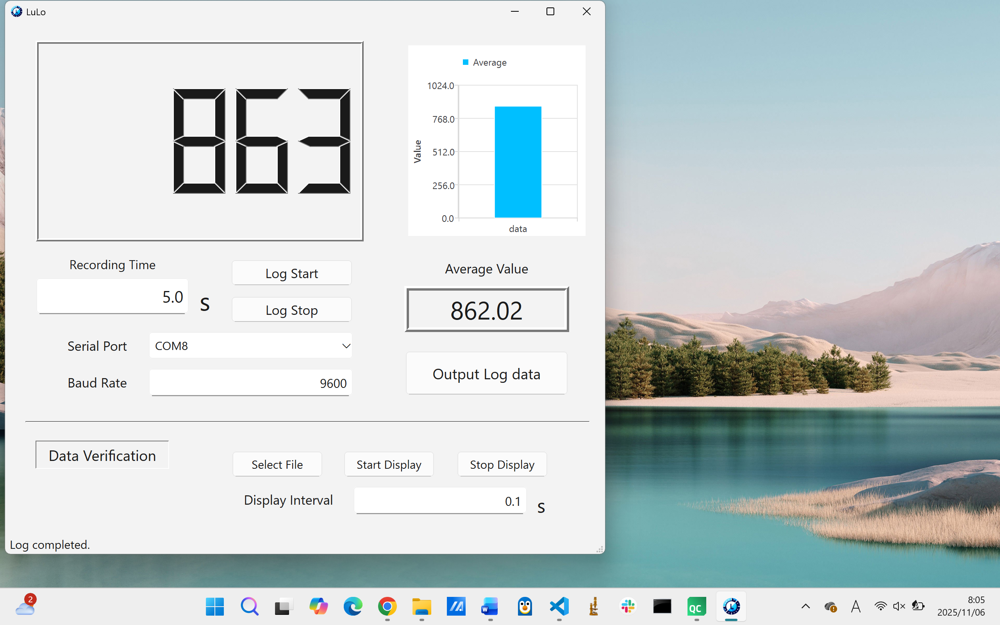

# 🌟 LuLo — Luminance Logger

> 💡 **LuLo（ルロ）** は、リアルタイム輝度計測・ロギングアプリケーションです。
> 「LuLo」は **Luminance Logger** の略称で、Qt（C++）で開発されています。
> Arduinoと連携し、輝度センサ値をシリアル通信で取得・可視化します。

---

## 🖥️ アプリ概要

|                     起動画面                     |                       Arduino連携時                      |
| :------------------------------------------: | :---------------------------------------------------: |
|  |  |

---

## 💡 主な機能

以下は `mainwindow.cpp` に実装された主要な機能です：

| カテゴリ                   | 主な内容                                                                     |
| ---------------------- | ------------------------------------------------------------------------ |
| 🪟 **UI・レイアウト**        | - アプリタイトルを `LuLo` に設定<br>- 画面サイズに応じた自動リサイズ<br>- フォントサイズの動的スケーリング         |
| 🔌 **シリアル通信**          | - `QSerialPort` によるArduino接続<br>- 利用可能ポートの自動検出<br>- ボーレート設定・接続管理         |
| 📊 **グラフ表示（QtCharts）** | - `QChart` と `QBarSeries` でリアルタイム描画<br>- 平均値をバー表示で可視化<br>- アニメーション対応棒グラフ |
| ⏱️ **記録・ロギング**         | - 記録時間をユーザ設定可能<br>- `QTimer` による一定間隔データ取得<br>- 測定終了後の平均値計算と表示            |
| 💾 **データ入出力**          | - `.csv` / `.txt` / `.dat` 形式で保存<br>- 保存済みデータの読み込み・再表示対応                 |
| 📈 **データ再生**           | - 過去データを一定間隔で再生表示<br>- 平均値の自動再計算とグラフ更新                                   |
| 🧭 **操作性**             | - Tab順設定・Enterキー操作対応<br>- ステータスバーに状態メッセージ表示                              |

---

## 🔌 Arduino連携

LuLoはArduinoを通じて輝度値を取得し、シリアル通信経由でPCへ送信します。

### スケッチの場所

```
arduino/LuLo_CdS_Serial/LuLo_CdS_Serial.ino
```

### 回路図

<p align="center">
  
</p>

### シリアル通信仕様

* **ボーレート**：115200
* **送信フォーマット**：`LIGHT:<value>\n`

---

## 📂 プロジェクト構成

```plaintext
LuLo/
├─ app/                      # Qtアプリ本体（C++ / Qt Widgets）
│   ├─ main.cpp
│   ├─ mainwindow.cpp
│   ├─ mainwindow.h
│   ├─ mainwindow.ui
│   ├─ LuLo.pro
│   ├─ resource.qrc
│   ├─ appicon.rc
│   └─ ...
│
├─ arduino/                  # Arduinoスケッチ（照度センサ制御）
│   └─ LuLo_CdS_Serial/
│       └─ LuLo_CdS_Serial.ino
│
├─ kicad/                    # 回路図・基板設計データ（KiCad 8）
│   ├─ LuLo.kicad_pro
│   ├─ LuLo.kicad_sch
│   ├─ LuLo.kicad_pcb
│   ├─ LuLo_schematic.pdf
│   └─ LuLo_schematic.svg
│
├─ images/                   # READMEやドキュメント用の画像
│   ├─ app_startup.png
│   ├─ running_with_arduino.png
│   └─ circuit_overview.png
│
├─ .gitignore                # Git追跡除外ルール
└─ README.md                 # プロジェクト概要（このファイル）
```

---

## 🛠️ ビルド手順

### 必要環境

* **Qt 6.5以降**（QtSerialPort / QtCharts モジュールを含む）
* **C++17 対応コンパイラ**（MinGW または MSVC）
* **Arduino IDE**（ファームウェア書き込み用）

### Qt側ビルド手順

1. `app/LuLo.pro` を **Qt Creator** で開く。
2. キットを設定（例：`Desktop Qt 6.5.3 MinGW 64-bit`）。
3. 「ビルド → qmakeの実行」。
4. 「ビルド → プロジェクトのビルド」。
5. `build` フォルダ内に `LuLo.exe` が生成されます。

---

## 📄 ライセンス

このプロジェクトは [MIT License](LICENSE) のもとで公開されています。
研究・教育・個人プロジェクト用途で自由に利用可能です。

